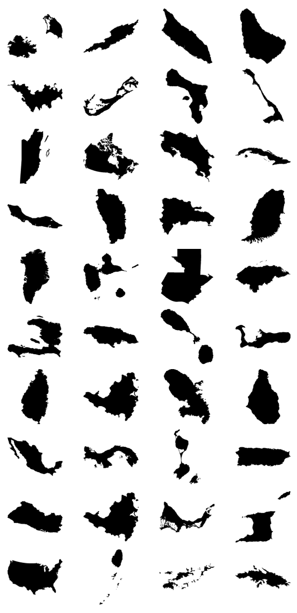
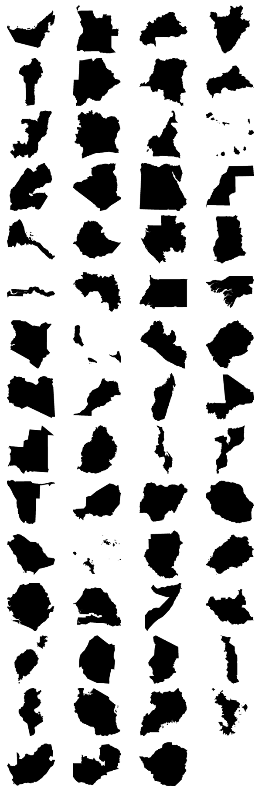
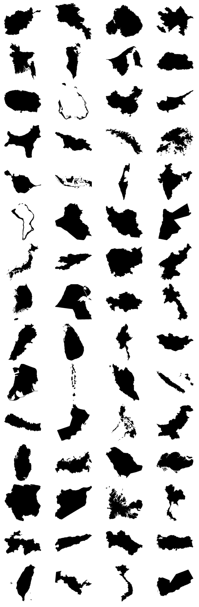
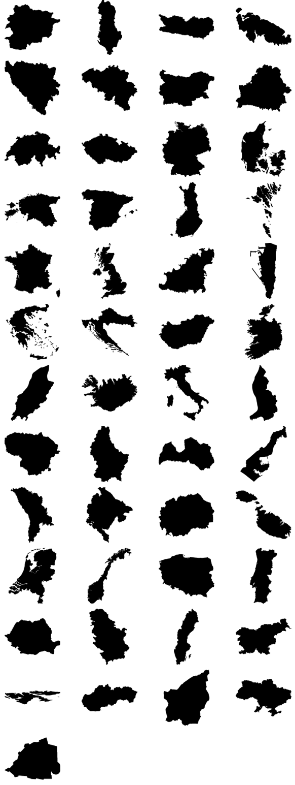
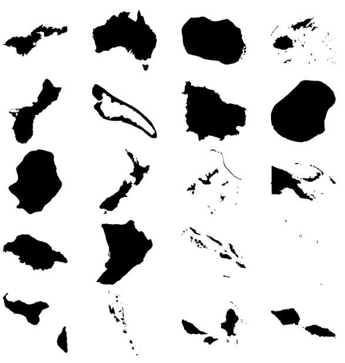
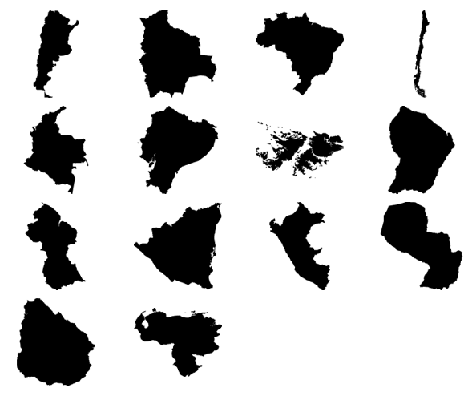
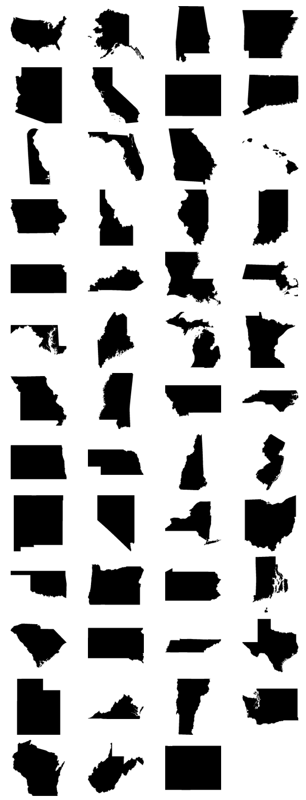

##  Update

Thanks so much for the suggestions everybody. I'm glad you like this project. However, I won't update anymore this repository. I'll let it as is from now on, for the community. For that matter, I've disabled the Issues. I hope you understand.

## Introduction

Mapsicon is a free collection of maps for nearly every country in the world, available in 11 different sizes, ranging from 16x16 pixels to 1024x1024 pixels, as well as `.svg` format. Those _maps_ are intented to serve as nice placeholders or illustations in your project - they do not replace real or extremely precise maps and they have no ambition to do so.

## Technical information

Icons are in PNG-8 bits with alpha transparency (basically, the background is transparent) and are in a black (#000) color.

## Optimization of the images

All the icons have been optimized to have the smallest possible size, using PNGOUT, AdvPNG, Pngcrush and OptiPNG (through ImageOptim). Basically, 1024 x 1024 icons weight around 12 KB.

## How are the maps named?

The maps are named after the official two-letter country codes defined in ISO 3166-1. Basically, that means the United States are named US, Canada is named CA - you get it.

## Are some countries omitted?

Some countries have been intentionally omitted, either because they have no official maps yet or because they are islands that are so small that they can not be drawn. The omitted countries are Micronesia, Jersey, Marshall Islands, Northern Mariana Islands, Palestinia, Tuvalu and United States Minor Outlying Islands.

## Why do I do this project?

I created this project because I needed to programmatically call icons of countries in a pet-project and I couldn't find any free/good icons online. I took my courage and created from scratch all those maps using Fireworks.

License
========

Do what you want with them as long as you mention me in your project. Please don't resell them - I forbid it!

Some help
========

If you need to access all those countries programmatically, here is a gist containing all the countries as well as their ISO code: https://gist.github.com/djaiss/2938259
